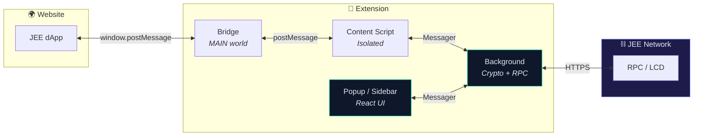
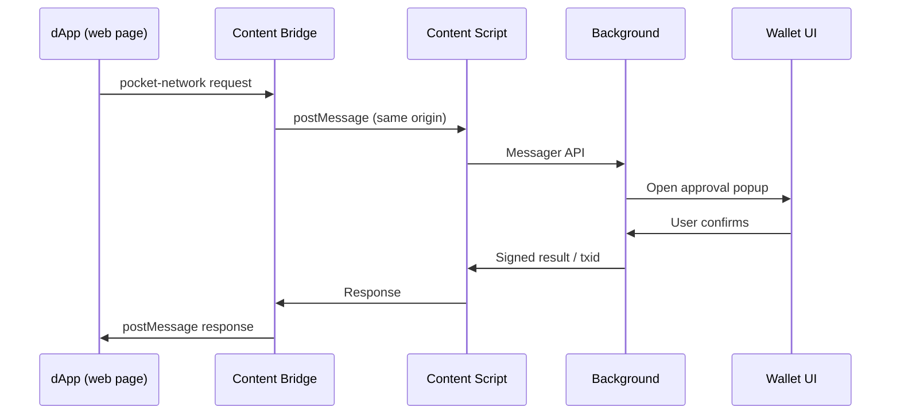
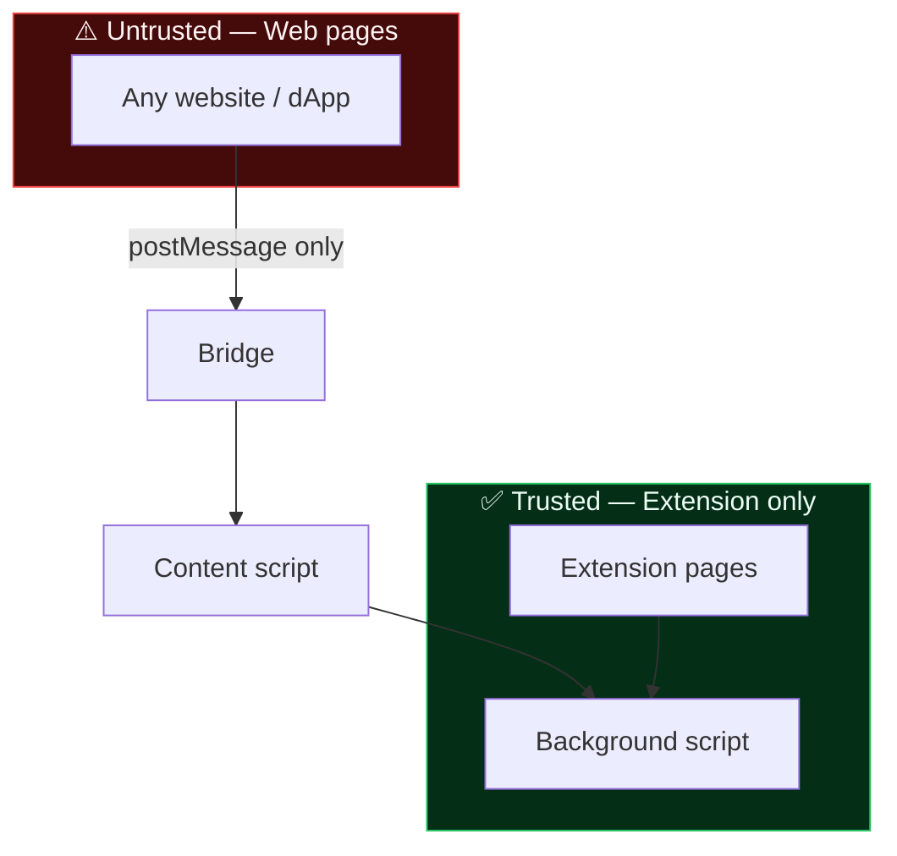

<div align="center">

<!-- ═══════════════════════════════════════════════════════════════════ -->
<!--  HERO                                                              -->
<!-- ═══════════════════════════════════════════════════════════════════ -->


# JEE Wallet

### Your keys. Your chain. Zero on-chain fees.

**The open-source, non-custodial browser wallet built natively for the [JEE blockchain](https://jee.money) — one install, every major browser.**

<br />

[](https://github.com/SujayPro/Jee-wallet/releases)
[](LICENSE)
[](https://www.typescriptlang.org/)
[](https://react.dev/)
[](https://turbo.build/)

<br />

[](https://www.google.com/chrome/)
[](https://brave.com)
[](https://www.microsoft.com/edge)
[](https://www.mozilla.org/firefox/)

<br />

[**🌐 Website**](https://jee.money) · [**🔍 Explorer**](https://jeescan.org) · [**📦 Releases**](https://github.com/SujayPro/Jee-wallet/releases) · [**🐛 Issues**](https://github.com/SujayPro/Jee-wallet/issues) · [**🔐 Security**](mailto:hello@jee.money)

<br />

```
     ██╗███████╗███████╗     ██╗    ██╗ █████╗ ██╗     ██╗     ███████╗████████╗
     ██║██╔════╝██╔════╝     ██║    ██║██╔══██╗██║     ██║     ██╔════╝╚══██╔══╝
     ██║█████╗  █████╗       ██║ █╗ ██║███████║██║     ██║     █████╗     ██║
██   ██║██╔══╝  ██╔══╝       ██║███╗██║██╔══██║██║     ██║     ██╔══╝     ██║
╚█████╔╝███████╗███████╗     ╚███╔███╔╝██║  ██║███████╗███████╗███████╗   ██║
 ╚════╝ ╚══════╝╚══════╝      ╚══╝╚══╝ ╚═╝  ╚═╝╚══════╝╚══════╝╚══════╝   ╚═╝
```

<br />

| | |
|:---:|:---|
| 🔥 | **Zero-fee L1** — send JEE without gas headaches |
| 🔐 | **Non-custodial** — keys never leave your device |
| 🌍 | **Cross-browser** — Chrome · Brave · Edge · Firefox |
| 🧩 | **dApp native** — connect, sign, send from any JEE site |
| 📦 | **One build** — `npm run bundle` → load everywhere |

<br />

<!-- Replace with your own demo GIF once you record one -->
<!--  -->
<!-- **↑ Drop a screen recording in `docs/assets/demo.gif` and uncomment this line** -->

</div>

<br />

---

## 📑 Table of Contents

- [Overview](#-overview)
- [Screenshots](#-screenshots)
- [Features](#-features)
- [Supported Browsers](#-supported-browsers)
- [Chain Info](#%EF%B8%8F-chain-info)
- [How It Works](#-how-it-works)
- [Quick Start](#-quick-start)
- [Install the Extension](#-install-the-extension)
- [Tech Stack](#-tech-stack)
- [Project Structure](#-project-structure)
- [Development](#-development)
- [SDK for dApp Developers](#-sdk-for-dapp-developers)
- [Security Model](#-security-model)
- [FAQ](#-faq)
- [Roadmap](#-roadmap)
- [Contributing](#-contributing)
- [Author](#-author)
- [License](#-license)

---

## 🌟 Overview

**JEE Wallet** is a production-grade browser extension wallet for the **JEE** zero-fee Layer-1 network. It ships as a single cross-browser build — no separate Chrome vs Firefox forks.

Built for real users and real dApps:

- Create HD wallets from a **12 / 24-word seed**
- Import **legacy private keys**
- Manage **multiple accounts** across wallets
- **Connect** to JEE dApps with explicit approval
- **Sign messages** and **send transactions** from a clean React UI
- **Auto-lock** after idle — session keys wiped on lock

> **Privacy first:** JEE Wallet collects **zero** telemetry. See [PRIVACY_POLICY.md](PRIVACY_POLICY.md).

---

## 📸 Screenshots

<!-- Add your own images to docs/assets/ and update paths below -->

<div align="center">

| Unlock & Dashboard | Send Transaction | dApp Connect |
|:---:|:---:|:---:|
| <!-- `` --> *Add screenshot* | <!-- `` --> *Add screenshot* | <!-- `` --> *Add screenshot* |

</div>

<details>
<summary><b>📁 How to add screenshots</b></summary>

1. Create folder: `docs/assets/`
2. Drop PNGs in (e.g. `unlock.png`, `send.png`, `connect.png`)
3. Uncomment the `` lines above
4. Optional: record a GIF → `docs/assets/demo.gif` → uncomment hero GIF

</details>

---

## ✨ Features

<table>
<tr>
<td width="50%" valign="top">

### 🔐 Wallet & Keys
- Non-custodial — **you** hold the keys
- **AES-256-GCM** encryption at rest
- Password-derived key (Argon2 + PBKDF2)
- HD wallet (BIP39 mnemonic)
- Legacy single-key import
- Multi-wallet · multi-account

</td>
<td width="50%" valign="top">

### 🌐 Web3 & UX
- JEE dApp connectivity
- Per-origin connect / disconnect
- Message signing
- Transaction send & stake flows
- Configurable auto-lock timer
- Popup (all browsers) + Firefox sidebar

</td>
</tr>
</table>

<details>
<summary><b>🔍 Full feature list</b></summary>

| | Feature | Details |
|:---:|:---|:---|
| 🔐 | Non-custodial | Private keys never leave your device |
| 🔒 | AES-256-GCM | Sensitive data encrypted with password-derived keys |
| 🌱 | HD Wallets | 12 or 24-word BIP39 mnemonics |
| 🔑 | Legacy import | Raw private key support |
| 🌐 | dApp bridge | Isolated + MAIN-world content scripts |
| ✍️ | Sign messages | Off-chain ownership proofs |
| 💸 | Send & stake | Full transaction flows with confirmation |
| ⏱️ | Auto-lock | Idle timeout → keys cleared from session |
| 📦 | Multi-account | Unlimited wallets & accounts locally |
| 🦊 | Cross-browser | Single manifest, single build |

</details>

---

## 🌍 Supported Browsers

| Browser | Min version | Toolbar | Side panel | Load method |
|:---|:---:|:---|:---|:---|
| **Google Chrome** | 114+ | Popup | — | Load unpacked → `dist/` |
| **Brave** | Latest | Popup | — | Load unpacked → `dist/` |
| **Microsoft Edge** | Latest | Popup | — | Load unpacked → `dist/` |
| **Mozilla Firefox** | **128+** | Popup | Sidebar | Temporary add-on → `dist/manifest.json` |

> **One command builds for all:** `npm run bundle` → output in `apps/extension/dist`

---

## ⛓️ Chain Info

<div align="center">

| Property | Value |
|:---|:---|
| **Network** | JEE Mainnet |
| **Chain ID** | `JEE` |
| **Bech32 prefix** | `jee` |
| **Native token** | **JEE** |
| **On-chain denom** | `jeff` |
| **Decimals** | `6` |
| **Tx fees** | **Zero** |
| **Block explorer** | [jeescan.org](https://jeescan.org) |
| **Official site** | [jee.money](https://jee.money) |

</div>

---

## ⚙️ How It Works

### Architecture



### dApp request flow



### Security boundaries



---

## 🚀 Quick Start

### Prerequisites

| Tool | Version |
|:---|:---:|
| [Node.js](https://nodejs.org) | **18+** |
| [npm](https://www.npmjs.com) | **9+** |
| Git | any recent |

### 1 · Clone

```sh
git clone https://github.com/SujayPro/Jee-wallet.git
cd Jee-wallet
npm install
```

### 2 · Environment

```sh
cp apps/extension/.env.example apps/extension/.env
```

Edit `apps/extension/.env`:

```env
JEE_MAINNET_LCD=https://your-lcd-endpoint
JEE_MAINNET_RPC=https://your-rpc-endpoint
```

Create `apps/extension-ui/.env.production.local`:

```env
REACT_APP_TOS_URL=https://jee.money/assets/tos.md
```

### 3 · Build

```sh
npm run bundle
```

✅ Output: **`apps/extension/dist`** (+ `apps/extension/dist.zip` for Firefox zip installs)

---

## 🧩 Install the Extension

### Chrome · Brave · Edge

```
chrome://extensions  →  Developer mode ON  →  Load unpacked  →  select dist/
```

1. Open `chrome://extensions` (or `brave://extensions`, `edge://extensions`)
2. Toggle **Developer mode** (top right)
3. **Load unpacked** → pick `apps/extension/dist`
4. Pin **JEE WALLET** to your toolbar
5. After rebuilds → hit **Refresh** on the extension card

### Firefox

```
about:debugging  →  Load Temporary Add-on  →  dist/manifest.json
```

1. Run `npm run bundle`
2. Open `about:debugging#/runtime/this-firefox`
3. **Load Temporary Add-on…**
4. Select **`apps/extension/dist/manifest.json`**

| ⚠️ Common mistake | Fix |
|:---|:---|
| White blank popup | You loaded `extension/` instead of **`extension/dist/`** |
| Invalid zip manifest | Don't zip the folder yourself — use `dist.zip` from bundle |
| dApp won't connect (Firefox) | Requires **Firefox 128+** |

**Firefox sidebar:** `View → Sidebar → JEE WALLET`

### Firefox Add-ons (AMO) submission

After `npm run bundle`, upload **`apps/extension/dist.zip`** to the [Firefox Developer Hub](https://addons.mozilla.org/developers/). Do **not** zip the `dist/` folder yourself — the bundle script packs `manifest.json` at the archive root and splits the background script into chunks under AMO's 5 MB per-file limit.

| Item | Value |
|:---|:---|
| Upload file | `apps/extension/dist.zip` |
| Distribution | **On this site** (public AMO listing) |
| Categories | **Privacy & Security**, **Web Development** |
| Data collection | **None** (`data_collection_permissions.required: ["none"]` in manifest) |
| Privacy policy | [PRIVACY_POLICY.md](PRIVACY_POLICY.md) |
| Source code | Submit the GitHub repo + build notes (`npm run bundle`) |

**Build notes for reviewers:** the background bundle is split into `bg-vendors-*.js` chunks plus `background.js`. Firefox loads them via `background.scripts`; Chrome uses an auto-generated `sw.js` that calls `importScripts()`. Minified-code warnings (`eval`, `Function`, `innerHTML`) come from bundled React/crypto dependencies — no remote code is loaded at runtime.

---

## 🛠 Tech Stack

<div align="center">


</div>

| Layer | Tech |
|:---|:---|
| UI | React 18, Redux Toolkit, React Router, Bootstrap 5, Sass |
| Extension | Manifest V3, cross-browser `ext` API shim |
| Crypto | AES-256-GCM, Argon2, BIP39 HD derivation |
| Build | Turborepo, webpack 5, Create React App (extension-ui) |
| Chain | JEE RPC / LCD, Cosmos-style addressing |

---

## 📁 Project Structure

```
Jee-wallet/
├── apps/
│   ├── extension/          # MV3 entry — background, content, bridge
│   ├── extension-ui/       # React popup & sidebar UI
│   └── sdk-demo/           # SDK playground
├── packages/
│   ├── background/         # Wallet logic, RPC, encryption
│   ├── content/            # dApp message relay (isolated world)
│   ├── content-bridge/     # Page-context injector (MAIN world)
│   ├── sdk/                # Core dApp SDK
│   ├── react-sdk/          # React hooks for dApps
│   ├── wallet-utils/       # Key derivation & chain utils
│   ├── util-browser/       # Cross-browser messaging & routes
│   └── …                   # types, constants, ui, util
└── apps/extension/dist/    # 👈 Load this in your browser
```

---

## 💻 Development

```sh
npm run dev          # Watch all packages
npm run build        # Build packages
npm run build-ui     # Build React UI only
npm run bundle       # Full extension build + dist.zip
npm run test         # Run test suite
npm run format       # Prettier format
```

<details>
<summary><b>🧪 Run specific tests</b></summary>

```sh
npm run test:wallet-utils
npm run test:background
npm run test:util
```

</details>

---

## 🔌 SDK for dApp Developers

Integrate JEE Wallet into your dApp:

| Package | Use case |
|:---|:---|
| [`packages/sdk`](packages/sdk) | Vanilla JS / any framework |
| [`packages/react-sdk`](packages/react-sdk) | React hooks (`useJeeWallet`, etc.) |
| [`apps/sdk-demo`](apps/sdk-demo) | Live integration example |

```sh
cd apps/sdk-demo && npm start   # Demo at localhost:3000
```

---

## 🔒 Security Model

> All sensitive operations execute **only** in the background script.  
> The UI and content scripts never touch raw private keys.

| Rule | Implementation |
|:---|:---|
| Keys stay local | Never sent over `postMessage` or network |
| Encrypted at rest | AES-256-GCM + password-derived keys |
| Session isolation | Auto-lock wipes in-memory secrets |
| dApp permissions | Explicit per-origin user approval |
| Connect / disconnect | Only extension UI can authorize origins |
| Message validation | UUID replay protection on dApp bridge |

**Responsible disclosure:** [hello@jee.money](mailto:hello@jee.money) — please report privately before public disclosure.

---

## ❓ FAQ

<details>
<summary><b>Is JEE Wallet custodial?</b></summary>

No. Your seed phrase and private keys are generated and stored **only on your device**, encrypted with your password. We never see them.

</details>

<details>
<summary><b>Which browsers are supported?</b></summary>

Chrome 114+, Brave, Edge, and Firefox 128+. One `npm run bundle` produces a build for all of them.

</details>

<details>
<summary><b>Why is my Firefox popup white/blank?</b></summary>

You almost certainly loaded the wrong folder. Load **`apps/extension/dist/manifest.json`**, not the parent `extension/` directory.

</details>

<details>
<summary><b>Does it work with MetaMask?</b></summary>

JEE Wallet is purpose-built for the **JEE chain** via the Pocket Network provider bridge — not EVM / MetaMask.

</details>

<details>
<summary><b>Where are my keys stored?</b></summary>

Encrypted in extension local storage. Session keys (unlocked state) live in extension session storage and are cleared on lock.

</details>

---

## 🗺 Roadmap

<!-- Customize this section — check items off as you ship -->

- [x] Cross-browser support (Chrome, Brave, Edge, Firefox)
- [x] HD & legacy wallet import
- [x] dApp connect / sign / send
- [x] Firefox sidebar panel
- [ ] Chrome Web Store listing
- [x] Firefox Add-ons (AMO) submission-ready build (`dist.zip`, manifest compliance)
- [ ] Firefox Add-ons (AMO) public listing approved
- [ ] Hardware wallet support
- [ ] Mobile companion app
- [ ] Multi-language UI

---

## 🤝 Contributing

Contributions welcome! To get started:

1. **Fork** the repo
2. **Create** a feature branch (`git checkout -b feature/amazing-thing`)
3. **Commit** your changes (`git commit -m 'Add amazing thing'`)
4. **Push** to the branch (`git push origin feature/amazing-thing`)
5. **Open** a Pull Request

Please keep PRs focused and run `npm run test` before submitting.

---

## 👤 Author

<div align="center">

**SujayPro**

Built by [SujayPro](https://github.com/SujayPro) · [Sujay@jee.money](mailto:Sujay@jee.money)

[](https://github.com/SujayPro)
[](mailto:Sujay@jee.money)
[](https://jee.money)

</div>

---

## 📄 License

[Apache License 2.0](LICENSE)

JEE Wallet is open source — use, modify, and distribute under Apache 2.0 terms.

Derived from [NodeWallet](https://github.com/decentralized-authority/nodewallet) (Decentralized Authority). See [NOTICE](NOTICE).

---

<div align="center">

<br />

**If JEE Wallet helps you — star the repo. It helps others find it.**

<br />

[](https://github.com/SujayPro/Jee-wallet/stargazers)

<br />

<sub>Built for JEE · Built for the open web · Zero fees on-chain</sub>

<br /><br />

</div>
