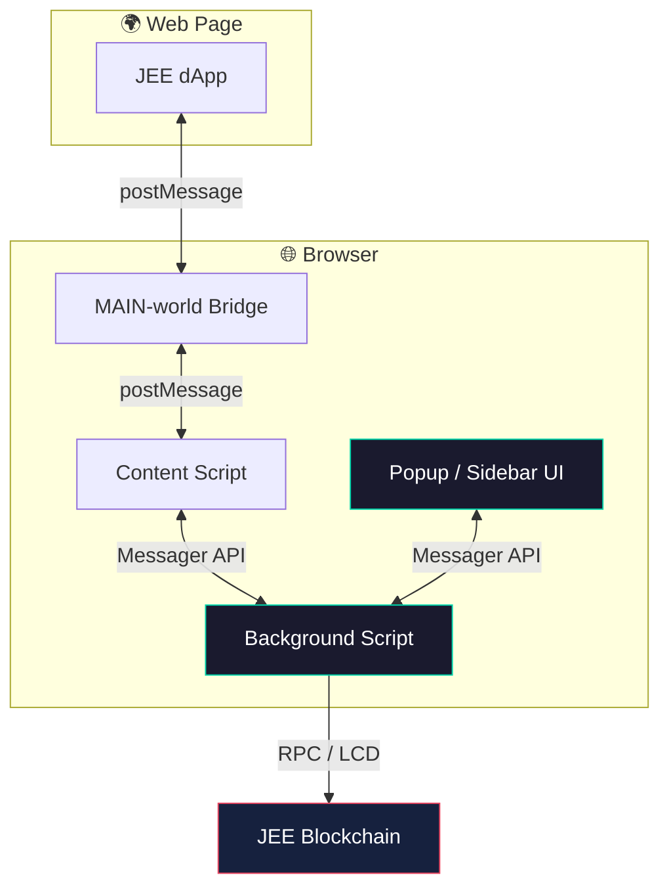

<div align="center">

# ⚡ JEE Wallet

**The non-custodial browser wallet for the JEE zero-fee Layer-1 blockchain.**

[](https://github.com/SujayPro/Jee-wallet)
[](LICENSE)
[](https://nodejs.org)
[](https://www.typescriptlang.org)

[](https://www.google.com/chrome/)
[](https://brave.com)
[](https://www.microsoft.com/edge)
[](https://www.mozilla.org/firefox/)

[**Website**](https://jee.money) · [**Explorer**](https://jeescan.org) · [**Report a Bug**](https://github.com/SujayPro/Jee-wallet/issues) · [**Security**](mailto:hello@jee.money)

---

```
     ██╗███████╗███████╗    ██╗    ██╗ █████╗ ██╗     ██╗     ███████╗████████╗
     ██║██╔════╝██╔════╝    ██║    ██║██╔══██╗██║     ██║     ██╔════╝╚══██╔══╝
     ██║█████╗  █████╗      ██║ █╗ ██║███████║██║     ██║     █████╗     ██║
██   ██║██╔══╝  ██╔══╝      ██║███╗██║██╔══██║██║     ██║     ██╔══╝     ██║
╚█████╔╝███████╗███████╗    ╚███╔███╔╝██║  ██║███████╗███████╗███████╗   ██║
 ╚════╝ ╚══════╝╚══════╝     ╚══╝╚══╝ ╚═╝  ╚═╝╚══════╝╚══════╝╚══════╝   ╚═╝
```

*One build. Every browser. Zero fees on-chain.*

</div>

---

## ✨ Features

| | Feature | Description |
|:---:|:---|:---|
| 🔐 | **Non-custodial** | Private keys never leave your device |
| 🔒 | **AES-256-GCM** | Password-derived encryption for all sensitive data |
| 🌱 | **HD Wallets** | 12 or 24-word mnemonic seed phrases |
| 🔑 | **Legacy import** | Import accounts via raw private key |
| 🌐 | **dApp ready** | Connect to JEE dApps with explicit approval |
| ✍️ | **Sign messages** | Prove wallet ownership off-chain |
| ⏱️ | **Auto-lock** | Configurable idle timeout |
| 📦 | **Multi-account** | Multiple wallets & accounts in one place |
| 🦊 | **Cross-browser** | Chrome · Brave · Edge · Firefox (128+) |

---

## ⛓️ Chain Info

<table>
<tr><td><b>Chain ID</b></td><td><code>JEE</code></td></tr>
<tr><td><b>Bech32 prefix</b></td><td><code>jee</code></td></tr>
<tr><td><b>Native token</b></td><td><b>JEE</b></td></tr>
<tr><td><b>On-chain denom</b></td><td><code>jeff</code></td></tr>
<tr><td><b>Decimals</b></td><td>6</td></tr>
<tr><td><b>Explorer</b></td><td><a href="https://jeescan.org">jeescan.org</a></td></tr>
<tr><td><b>Website</b></td><td><a href="https://jee.money">jee.money</a></td></tr>
</table>

---

## 🏗️ Architecture



---

## 🚀 Quick Start

### Prerequisites

- **Node.js** 18+
- **npm** 9+

### 1 · Clone & install

```sh
git clone https://github.com/SujayPro/Jee-wallet.git
cd Jee-wallet
npm install
```

### 2 · Configure environment

```sh
cp apps/extension/.env.example apps/extension/.env
```

Edit `apps/extension/.env`:

```env
JEE_MAINNET_LCD=<your JEE LCD endpoint>
JEE_MAINNET_RPC=<your JEE RPC endpoint>
```

Create `apps/extension-ui/.env.production.local`:

```env
REACT_APP_TOS_URL=https://jee.money/assets/tos.md
```

### 3 · Build

```sh
npm run bundle
```

Output lands in **`apps/extension/dist`** — one build for all browsers.

---

## 🧩 Load the Extension

### Chrome · Brave · Edge

1. Open `chrome://extensions` (or `brave://extensions`, `edge://extensions`)
2. Enable **Developer mode**
3. Click **Load unpacked**
4. Select `apps/extension/dist`
5. After rebuilds → click **Refresh** on the extension card

### Firefox

1. Run `npm run bundle`
2. Open `about:debugging#/runtime/this-firefox`
3. Click **Load Temporary Add-on…**
4. Select **`apps/extension/dist/manifest.json`**

> ⚠️ **White blank popup?** You loaded the wrong folder.  
> Location in `about:debugging` must end with **`/dist`**, not `/extension`.

| Browser | Toolbar | Side view |
|:---|:---|:---|
| Chrome / Brave / Edge | Popup | — |
| Firefox 128+ | Popup | **View → Sidebar → JEE WALLET** |

---

## 📁 Project Structure

Monorepo powered by [Turborepo](https://turbo.build/repo).

```
apps/
  extension/        # Extension entry points (background, content, bridge)
  extension-ui/     # React UI (popup + sidebar)
  sdk-demo/         # SDK demo app

packages/
  background/       # Background script logic
  content/          # dApp content script (isolated world)
  content-bridge/   # Injected MAIN-world bridge
  react-sdk/        # React hooks for dApp devs
  sdk/              # Core SDK for dApp devs
  wallet-utils/     # Derivation & chain utilities
  util-browser/     # Cross-browser WebExtension API
  …
```

---

## 🛠️ Development

```sh
npm run dev          # Watch mode (all packages)
npm run test         # Run tests
npm run build        # Build packages only
npm run build-ui     # Build React UI only
npm run bundle       # Full extension build + dist.zip
```

---

## 🔌 SDK

Building a dApp? Check out:

- [`packages/sdk`](packages/sdk) — Core JavaScript SDK
- [`packages/react-sdk`](packages/react-sdk) — React hooks

---

## 🔒 Security

All sensitive operations run in the background script only:

- Private keys & seed phrases **never** pass through `window.postMessage`
- Session data encrypted at rest in extension storage
- Auto-lock clears session keys on idle
- dApp connections require explicit user approval
- Only the extension UI can approve or revoke site connections

**Found a vulnerability?** Report privately to **hello@jee.money** before public disclosure.

---

## 🛡️ Privacy

JEE Wallet collects **zero** user data. See [PRIVACY_POLICY.md](PRIVACY_POLICY.md).

---

## 📄 License

[Apache License 2.0](LICENSE)

Derived from [NodeWallet](https://github.com/decentralized-authority/nodewallet) by Decentralized Authority — see [NOTICE](NOTICE).

---

<div align="center">

**Built for JEE · Built for the open web**

⭐ Star this repo if JEE Wallet helps you!

</div>
